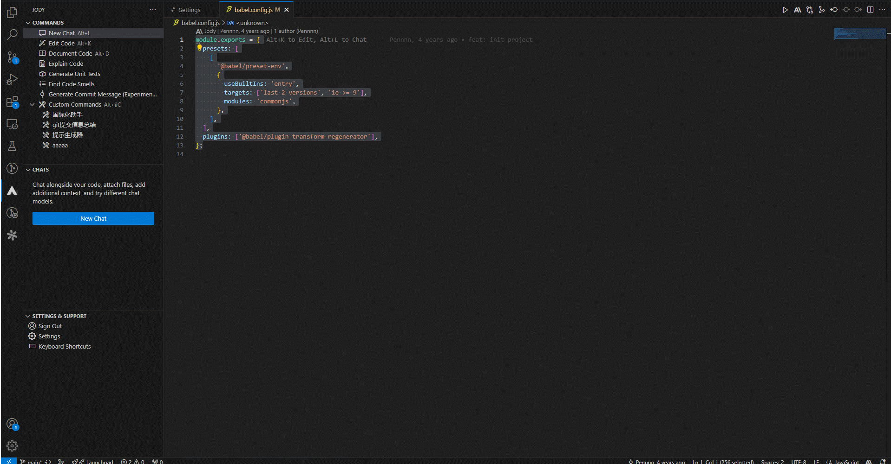

## Chat

Answer questions about general programming topics, or specific to your codebase, with Jody chat. You can choose between LLMs, @-mentions files and symbols, and enable enhanced repository-wide code context.

You can start a chat at any time using the default keyboard shortcut of `Option` `/` on macOS and `Alt` `/` on Windows & Linux.
