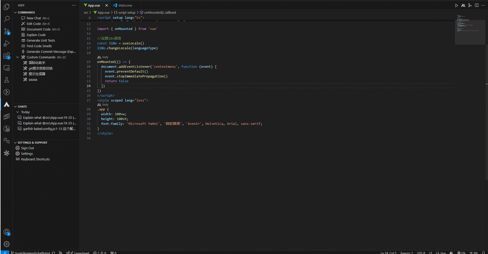

## Cody Commands

Cody has a range of commands for explaining code, generating unit tests, adding documentation, and more.

To get started: select code in your editor, right click, and choose a command from the "Cody" menu.

You can also use the [Cody: Commands Menu](command:cody.menu.commands) which has the default keyboard shortcut of `Option` `C` on macOS and `Alt` `C` on Windows & Linux.

**✨ Pro-tips for using Cody commands**
 • You can build your own Custom Commands with custom prompts, output into chat or perform code edits, and more.
