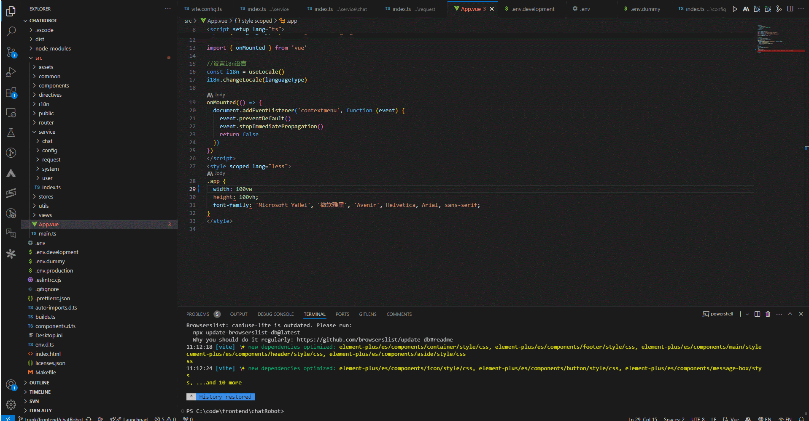

## Fix Code

Something wrong with your code? Use Jody’s "Ask Jody to Fix" command to fix it, or explain the problem.

**✨ Pro-tips for fixing code with Jody**
 • You can open the 💡 menu, with an "Ask Jody to Fix" option, by moving the cursor over any line of code with an error and using the keyboard shortcut `Cmd+.`/`Ctrl+.`.
 • You can also right click on any items in the "Problems" tab of VS Code and select "Ask Jody to Fix".
