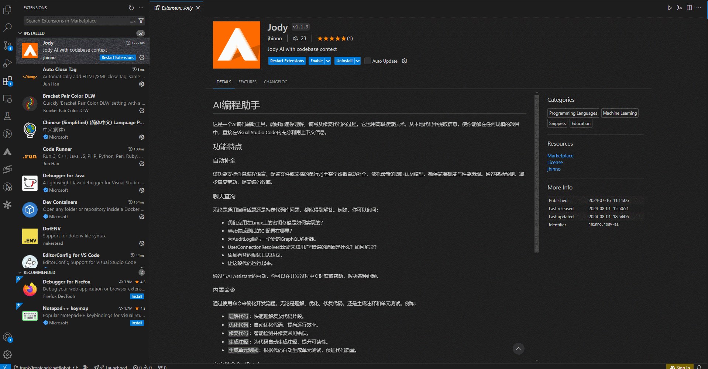

## 登录

 • 点先击左侧景行 logo，呼出插件页面
 • 在插件页面点击插件配置
 • 准确填写问答服务的地址和补全服务地址。例如：
 • Jody>Chat:Sever Endpoint（问答服务 URL）：https://192.168.0.22:443/dockerService/FastChat-pzhlei-de6004c2-b357-441a-bb4a-7dc5ac83b9e3/
 • Jody>Autocomplete>Advanced:Sever Endpoint(补全服务 URL)：https://192.168.0.22:443/dockerService/FastChat-pzhlei-bbeebbfb-dd57-48c1-a472-2cf8e119732c/
 • Jh Sever(景行门户服务，门户版本必须大于等于v6.2，且必须安装AI):https://192.168.0.22/
